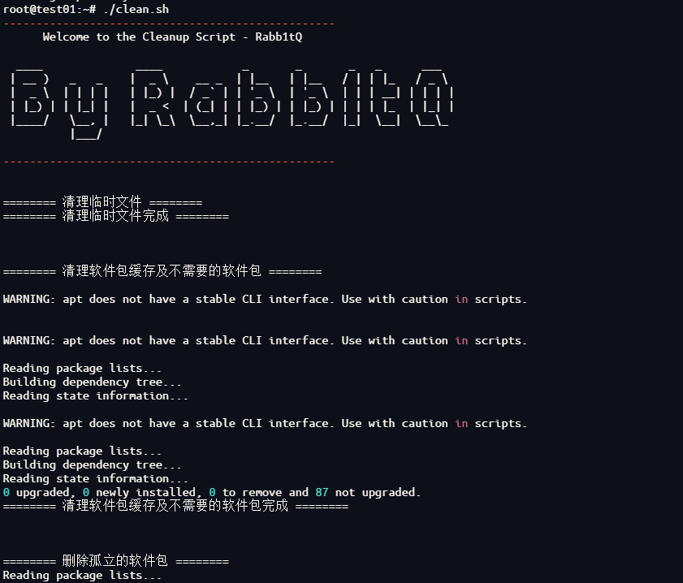

# LinuxCleanUpScript

## 免责声明！！！

本软件/服务/代码可能存在未知缺陷或问题，使用过程中可能会出现**<font color=red>系统崩溃</font>**等不可预见的情况。请您在使用前仔细审查代码，自行评估其适用性。若您选择使用，意味着您已了解并接受可能存在的风险。**<font color=red>作者不对使用本软件/服务/代码所引起的任何直接或间接损失承担责任</font>**。

## 描述

**<font color=red>注：暂时只支持debian其他系统请自行尝试是否好使</font>**

最近买了个小磁盘的云服务器，装了一些服务导致磁盘空间不够用了，但是网上的教程基本上都是一条一条的命令，于是整合一下，写个脚本出来，经测试，原本磁盘空间剩余两百多M清理后空间为1.5G，运行效果如下：



## 使用

下载脚本后执行：

```sh
chmod 777 ./clean.sh
./clean.sh
```

执行后会在当前目录生成`cleanup.log`文件，此文件为脚本执行日志

**<font color=red>注：部分功能需要用户交互，同时为防止删除必要文件，大文件查找后请自行手动删除</font>**

